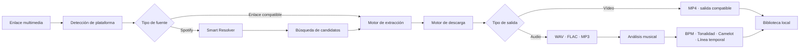
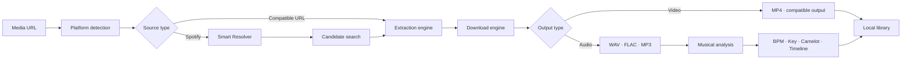

<!--
  DIAVLO WAV — README oficial bilingüe de publicaciones
  Coloca este archivo en: Nikolai-coder/diavlo-wav-releases/README.md
-->

<div align="center">


<a href="https://github.com/Nikolai-coder/diavlo-wav-releases/releases/latest">
  
</a>

<br />

[](https://github.com/Nikolai-coder/diavlo-wav-releases/releases/latest)
[](https://github.com/Nikolai-coder/diavlo-wav-releases/releases)
[](#requisitos-del-sistema--system-requirements)
[](#requisitos-del-sistema--system-requirements)
[](#identidad-canaria--canary-identity)

<br />

### Estación multimedia nativa para descargar, convertir y analizar contenido en Windows.

### Native Windows workstation for media extraction, conversion and musical analysis.

**Una aplicación. Un comando. Un flujo creativo.**
**One application. One command. One focused workflow.**

[](https://github.com/Nikolai-coder/diavlo-wav-releases/releases/latest)
[](https://github.com/Nikolai-coder/diavlo-wav-releases/releases/latest/download/DiavloWAV-Setup-x64.exe)
[](https://github.com/Nikolai-coder/diavlo-wav-releases)

<br />

[🇪🇸 Español](#español)　•　[🇬🇧 English](#english)

`DESCARGA`　•　`CONVIERTE`　•　`ANALIZA`　•　`CREA`

</div>

---

# Español

## `01 // INSTALACIÓN`

Abre **PowerShell** y ejecuta:

```powershell
irm "https://github.com/Nikolai-coder/diavlo-wav-releases/releases/latest/download/install.ps1" | iex
```

El comando obtiene el instalador oficial desde la **última publicación de GitHub** e inicia la instalación compatible con Windows.

DIAVLO WAV incluye sus componentes multimedia esenciales. No necesitas instalar manualmente FFmpeg, FFprobe, yt-dlp, Deno, Node.js, Python ni Rust.

> [!IMPORTANT]
> Instala DIAVLO WAV únicamente desde este repositorio o desde los archivos oficiales de sus publicaciones en GitHub.

<details>
<summary><strong>Inspeccionar el instalador antes de ejecutarlo</strong></summary>

<br />

```powershell
$script = "$env:TEMP\diavlowav-install.ps1"

irm "https://github.com/Nikolai-coder/diavlo-wav-releases/releases/latest/download/install.ps1" `
  -OutFile $script

notepad $script
```

Después de revisarlo:

```powershell
& $script
```

Esto guarda el script oficial en tu equipo, lo abre para inspeccionarlo y solamente lo ejecuta cuando tú decides continuar.

</details>

<details>
<summary><strong>Instalación tradicional en Windows</strong></summary>

<br />

1. Abre la [última publicación](https://github.com/Nikolai-coder/diavlo-wav-releases/releases/latest).
2. Descarga `DiavloWAV-Setup-x64.exe`.
3. Ejecuta el instalador.
4. Abre DIAVLO WAV.

</details>

---

## `02 // EL PRODUCTO`

DIAVLO WAV es una **estación audiovisual nativa para Windows** creada para reducir la distancia entre encontrar contenido y tenerlo preparado dentro de un flujo creativo.

Reúne descarga, listas de reproducción, conversión, gestión local, análisis musical y actualizaciones automáticas dentro de una única aplicación de escritorio.

<table>
<tr>
<td width="33%" valign="top">

### ⬇️ Descargar

* Enlaces individuales
* Listas de reproducción
* Cola de tareas
* Progreso en tiempo real
* Cancelación de descargas
* Carpeta de destino configurable
* Apertura directa del archivo
* Apertura directa de la carpeta
* Procesamiento sin ventanas de terminal

</td>
<td width="33%" valign="top">

### ♻️ Convertir

* WAV
* FLAC
* MP3
* MP4
* Extracción de audio
* Conversión mediante FFmpeg
* Procesamiento local
* Nombres de archivo seguros
* Componentes integrados
* Diferentes calidades de salida

</td>
<td width="33%" valign="top">

### 🎛️ Analizar

* Detección de BPM
* Tonalidad y modo musical
* Notación Camelot
* Indicadores de confianza
* Lectura half-time y double-time
* Cambios musicales en la línea temporal
* Información lista para producción
* Resultados asociados al archivo

</td>
</tr>
</table>

> [!NOTE]
> La compatibilidad con plataformas externas puede cambiar cuando estas modifican sus páginas, sistemas de autenticación o reglas de acceso. DIAVLO WAV no elimina DRM ni protecciones de servicios de pago.

---

## `03 // SPOTIFY SMART RESOLVER` — BETA

DIAVLO WAV puede reconocer enlaces de Spotify correspondientes a:

* canciones;
* álbumes;
* playlists;
* enlaces regionales como `/intl-es/`;
* enlaces con parámetros adicionales.

El Smart Resolver utiliza Spotify para consultar **metadatos** y ayudar a localizar una fuente compatible para el flujo de descarga.

```text
ENLACE DE SPOTIFY
        │
        ▼
METADATOS DEL CONTENIDO
        │
        ▼
BÚSQUEDA DE CANDIDATOS
        │
        ▼
PUNTUACIÓN DE COINCIDENCIA
        │
        ▼
REVISIÓN O DESCARGA
```

Spotify se utiliza únicamente como fuente de información.

**DIAVLO WAV no descarga audio directamente desde Spotify, no descifra transmisiones y no evita DRM.**

> [!WARNING]
> La conexión con Spotify continúa en fase beta. Debido a las limitaciones de la aplicación de desarrollador, algunas cuentas pueden no estar autorizadas temporalmente.

Todos los usuarios utilizan el Client ID público oficial configurado en DIAVLO WAV. No es necesario que cada usuario cree su propio Client ID.

---

## `04 // FLUJO DE SEÑAL`



```text
┌─ DIAVLO SIGNAL / NÚCLEO DE ANÁLISIS ─────────────────────────────┐
│                                                                  │
│  BPM             140                                             │
│  TONALIDAD       F# MENOR                                        │
│  CAMELOT         11A                                             │
│  CONFIANZA       ██████████████████░░  91%                       │
│                                                                  │
│  LÍNEA TEMPORAL                                                  │
│  00:00 ━━━━━━━━━━━ 01:12    140 BPM · F# Menor                   │
│  01:12 ━━━━━━━━━━━ 02:26    155 BPM · F# Menor                   │
│                                                                  │
│  DETECCIÓN       CAMBIO DE BPM                                   │
│  ESTADO          ANÁLISIS COMPLETADO                             │
│                                                                  │
└──────────────────────────────────────────────────────────────────┘
```

---

## `05 // DISEÑO Y RENDIMIENTO`

La interfaz actual de DIAVLO WAV está orientada a la simplicidad, la estabilidad y el rendimiento.

Se ha eliminado el antiguo sistema Liquid Glass y sus efectos visuales pesados para construir una experiencia más sólida y directa.

<table>
<tr>
<td width="50%" valign="top">

### Diseño

* Interfaz oscura y minimalista
* Superficies opacas
* Jerarquía visual clara
* Espaciado consistente
* Controles planos
* Tipografía legible
* Menos elementos decorativos
* Estados más fáciles de entender

</td>
<td width="50%" valign="top">

### Rendimiento

* Sin efectos Liquid Glass
* Sin partículas
* Sin fondos animados
* Sin brillos innecesarios
* Sin animaciones decorativas
* Menor profundidad de DOM
* Menos trabajo gráfico permanente
* Menos listeners visuales
* Mejor estabilidad en WebView2

</td>
</tr>
</table>

La calidad visual se apoya en las proporciones, el contraste, el espaciado y la alineación, no en efectos que consuman recursos innecesariamente.

---

## `06 // POR QUÉ DIAVLO WAV`

| Capacidad                          | Enfoque DIAVLO                                                                   |
| ---------------------------------- | -------------------------------------------------------------------------------- |
| **Aplicación nativa para Windows** | Un flujo de escritorio dedicado en lugar de un laberinto de pestañas.            |
| **Instalación con un comando**     | La última versión compatible está siempre a una orden de distancia.              |
| **Sin dependencias manuales**      | Los componentes multimedia esenciales se distribuyen con la aplicación.          |
| **Inteligencia para creadores**    | BPM, tonalidad, Camelot y línea temporal permanecen junto al archivo.            |
| **Procesamiento local**            | Los archivos terminan en la ubicación elegida por el usuario.                    |
| **Cola y progreso**                | Las tareas pueden organizarse, seguirse y cancelarse desde la aplicación.        |
| **Publicaciones versionadas**      | Cada versión pública se distribuye mediante publicaciones rastreables de GitHub. |
| **Verificación de integridad**     | Los hashes publicados permiten comprobar los archivos descargados.               |
| **Actualizador firmado**           | Las versiones compatibles pueden detectar e instalar actualizaciones necesarias. |
| **Interfaz optimizada**            | Una experiencia estática, rápida y centrada en la función.                       |

---

## `07 // NÚCLEO TECNOLÓGICO`

<div align="center">


</div>

```text
DIAVLO WAV
├── Aplicación de escritorio ... Tauri 2
├── Núcleo nativo .............. Rust
├── Interfaz ................... React + TypeScript
├── Construcción ............... Vite
├── Motor multimedia ........... FFmpeg + FFprobe
├── Extracción ................. yt-dlp
├── Runtime auxiliar ........... Deno
├── Análisis ................... BPM · tonalidad · Camelot
├── Instalador ................. NSIS + PowerShell
├── Bootstrap .................. Rust
├── Actualizador ............... Tauri Updater firmado
└── Distribución ............... GitHub Releases
```

> Este repositorio es el **canal público oficial de publicaciones**. El código fuente y la infraestructura privada de construcción pueden mantenerse por separado.

---

## `08 // ACTUALIZACIONES AUTOMÁTICAS`

DIAVLO WAV incluye un actualizador interno firmado.

Cuando existe una versión superior compatible:

```text
INICIO DE LA APLICACIÓN
        │
        ▼
COMPROBACIÓN DE VERSIÓN
        │
        ▼
DESCARGA FIRMADA
        │
        ▼
VERIFICACIÓN
        │
        ▼
INSTALACIÓN
        │
        ▼
REINICIO
```

El flujo de actualización:

* consulta el manifiesto oficial;
* compara la versión instalada;
* bloquea versiones que requieren actualización;
* descarga el paquete firmado;
* muestra el progreso;
* instala la nueva versión;
* reinicia la aplicación.

Las actualizaciones obligatorias pueden contener correcciones de seguridad, compatibilidad, estabilidad o cambios necesarios en el motor multimedia.

El manifiesto público del actualizador se distribuye como:

```text
latest.json
```

junto con la firma correspondiente del paquete.

---

## `09 // TELEMETRÍA EN VIVO`

<div align="center">

[](https://github.com/Nikolai-coder/diavlo-wav-releases/releases/latest)
[](https://github.com/Nikolai-coder/diavlo-wav-releases/releases/latest)
[](https://github.com/Nikolai-coder/diavlo-wav-releases/releases)
[](https://github.com/Nikolai-coder/diavlo-wav-releases/commits/main)
[](https://github.com/Nikolai-coder/diavlo-wav-releases)

</div>

---

## `10 // IDENTIDAD CANARIA` 🌋🌊

DIAVLO WAV nace en las **Islas Canarias**, entre paisaje volcánico, océano Atlántico y una cultura acostumbrada a mirar más allá del horizonte.

```text
NEGRO VOLCÁNICO   La base técnica: sólida, directa y resistente.
AZUL ATLÁNTICO    La conexión: abierta, rápida y preparada para viajar.
VIOLETA NOCTURNO  La identidad: oscura, creativa y reconocible.
ORIGEN            ISLAS CANARIAS · 28°N
DESTINO           CUALQUIER ESCRITORIO DEL MUNDO
```

> **Construido desde unas islas. Diseñado sin límites.**

---

## `11 // REQUISITOS DEL SISTEMA`

| Requisito                 | Configuración compatible                                                         |
| ------------------------- | -------------------------------------------------------------------------------- |
| **Sistema operativo**     | Windows 10 o Windows 11                                                          |
| **Arquitectura**          | x64                                                                              |
| **PowerShell**            | Windows PowerShell 5.1+ o PowerShell 7+                                          |
| **Internet**              | Necesario para instalar, actualizar y procesar enlaces en línea                  |
| **Almacenamiento**        | Depende de la duración, la lista y el formato de salida                          |
| **Permisos**              | Permisos normales de instalación; puede solicitar elevación cuando sea necesario |
| **Dependencias externas** | No requiere instalación manual de FFmpeg, yt-dlp, Deno, Node.js, Python o Rust   |

---

## `12 // COMANDOS DISPONIBLES`

Después de instalar DIAVLO WAV puedes utilizar:

```powershell
diavlowav
```

Abre la aplicación.

```powershell
diavlowav --version
```

Muestra la versión instalada.

```powershell
diavlowav doctor
```

Comprueba la instalación, los componentes y las rutas principales.

```powershell
diavlowav repair
```

Repara o reinstala los componentes necesarios.

```powershell
diavlowav uninstall
```

Inicia la desinstalación.

---

## `13 // VERIFICAR LA PUBLICACIÓN`

Los archivos publicados pueden incluir hashes SHA-256.

Para calcular el hash del instalador:

```powershell
Get-FileHash ".\DiavloWAV-Setup-x64.exe" -Algorithm SHA256
```

Compara el resultado con el hash incluido en la publicación correspondiente.

<details>
<summary><strong>Comparación automática del hash</strong></summary>

<br />

```powershell
$installer = ".\DiavloWAV-Setup-x64.exe"
$checksumFile = ".\DiavloWAV-Setup-x64.exe.sha256"

$actual = (Get-FileHash $installer -Algorithm SHA256).Hash.ToLower()
$expected = ((Get-Content $checksumFile -Raw) -split '\s+')[0].Trim().ToLower()

if ($actual -eq $expected) {
    Write-Host "Integridad de DIAVLO WAV verificada." -ForegroundColor Green
} else {
    Write-Error "El hash no coincide. No ejecutes este instalador."
}
```

</details>

---

## `14 // SOLUCIÓN DE PROBLEMAS`

<details>
<summary><strong>La actualización automática no aparece</strong></summary>

<br />

1. Cierra completamente DIAVLO WAV.
2. Comprueba que no continúe abierto desde el Administrador de tareas.
3. Abre la aplicación instalada nuevamente.
4. Verifica tu conexión a Internet.
5. Ejecuta:

```powershell
diavlowav doctor
```

Si continúa fallando:

```powershell
diavlowav repair
```

También puedes instalar nuevamente la versión oficial sin desinstalar primero:

```powershell
irm "https://github.com/Nikolai-coder/diavlo-wav-releases/releases/latest/download/install.ps1" | iex
```

</details>

<details>
<summary><strong>Spotify no permite conectar una cuenta</strong></summary>

<br />

La integración con Spotify continúa en beta.

Algunas cuentas pueden no estar autorizadas temporalmente debido a las limitaciones de la aplicación de desarrollador.

El usuario no debe introducir un Client ID diferente. DIAVLO WAV utiliza un único Client ID público oficial.

Las funciones normales que no dependan de Spotify pueden continuar utilizándose.

</details>

<details>
<summary><strong>PowerShell bloquea el comando</strong></summary>

<br />

Ejecuta el comando desde una ventana normal de PowerShell.

Cuando una política de empresa o centro educativo bloquee scripts, utiliza el instalador `.exe` de la última publicación en lugar de reducir globalmente la seguridad del sistema.

</details>

<details>
<summary><strong>Una plataforma deja de funcionar</strong></summary>

<br />

Las páginas externas cambian con frecuencia.

Instala primero la última versión de DIAVLO WAV. Algunas fuentes pueden requerir autenticación o no estar disponibles por restricciones regionales, de cuenta o DRM.

</details>

<details>
<summary><strong>Falla una descarga o conversión</strong></summary>

<br />

Comprueba:

* que el enlace abre correctamente;
* que existe espacio libre;
* que la carpeta permite escritura;
* que tienes instalada la última versión;
* que el formato elegido es compatible;
* que el contenido está disponible en tu región;
* que la cuenta tiene acceso al contenido;
* que la fuente no está protegida mediante DRM.

Conserva el mensaje de error completo al informar del problema.

</details>

<details>
<summary><strong>La aplicación exige una actualización</strong></summary>

<br />

Completa la actualización desde el actualizador interno.

Las versiones obligatorias pueden contener cambios de compatibilidad, seguridad o del motor multimedia necesarios para continuar funcionando correctamente.

</details>

---

## `15 // SEGURIDAD Y PRIVACIDAD`

* El procesamiento está diseñado alrededor de un **flujo local de escritorio**.
* Los archivos se guardan en la carpeta elegida por el usuario.
* Descarga únicamente desde este repositorio y sus archivos oficiales.
* Verifica los hashes cuando estén disponibles.
* No confíes en instaladores resubidos a páginas de terceros.
* No publiques contraseñas, cookies, tokens ni datos privados en los reportes.
* Revisa el script de instalación localmente cuando necesites máxima transparencia.
* DIAVLO WAV no necesita un Client Secret de Spotify integrado en la aplicación.
* Las credenciales no deben almacenarse en texto plano.
* Las actualizaciones se distribuyen mediante paquetes firmados.

Para comunicar una posible vulnerabilidad, evita publicar detalles sensibles en una incidencia pública y contacta de forma privada con el mantenedor mediante su perfil de GitHub.

---

## `16 // ESTADO DE PLATAFORMAS`

| Plataforma              | Estado        |
| ----------------------- | ------------- |
| **Windows 10/11 x64**   | Disponible    |
| **macOS Apple Silicon** | En desarrollo |
| **macOS Intel**         | En desarrollo |
| **Linux**               | No anunciado  |

La futura versión para macOS utilizará instaladores DMG separados para Apple Silicon e Intel.

Hasta que estos instaladores aparezcan dentro de una publicación oficial, no descargues supuestas versiones de macOS desde páginas de terceros.

---

## `17 // HOJA DE RUTA`

```text
[✓] Instalador nativo para Windows
[✓] Instalación mediante PowerShell
[✓] Publicaciones versionadas en GitHub
[✓] Flujos de salida de audio y vídeo
[✓] Gestión de listas de reproducción
[✓] Cola, progreso y cancelación
[✓] Análisis de BPM, tonalidad y Camelot
[✓] Detección de cambios en la línea temporal
[✓] Spotify Smart Resolver beta
[✓] Actualizador obligatorio y firmado
[✓] Interfaz minimalista sin Liquid Glass
[✓] Eliminación de animaciones decorativas
[✓] Componentes multimedia integrados
[ ] Ampliar la compatibilidad pública de Spotify
[ ] Diagnósticos y herramientas de reparación ampliados
[ ] Controles más profundos de cola y biblioteca
[ ] Instalador DMG para Apple Silicon
[ ] Instalador DMG para Mac Intel
[ ] Firma y notarización de macOS
[ ] Actualizador multiplataforma
[ ] Más mejoras de rendimiento y fiabilidad
```

La hoja de ruta indica dirección, no fechas garantizadas. Las versiones se publican cuando alcanzan el nivel de calidad necesario.

---

## `18 // USO RESPONSABLE`

DIAVLO WAV es una utilidad técnica para contenido multimedia.

Úsala únicamente con:

* archivos propios;
* contenido creado por ti;
* material de dominio público;
* contenido con licencia compatible;
* contenido que tengas autorización legal para descargar y procesar.

El proyecto no está afiliado con YouTube, Spotify, SoundCloud, TikTok, X, Reddit, Apple, Tidal ni otras plataformas.

Las marcas, nombres y servicios pertenecen a sus respectivos propietarios.

DIAVLO WAV no está diseñado para:

* evitar suscripciones;
* descifrar DRM;
* saltarse controles de acceso;
* descargar transmisiones protegidas;
* vulnerar derechos de autor.

El usuario es responsable del uso que realice de la herramienta.

---

# English

## `01 // INSTALLATION`

Open **PowerShell** and run:

```powershell
irm "https://github.com/Nikolai-coder/diavlo-wav-releases/releases/latest/download/install.ps1" | iex
```

The command retrieves the official installer from the **latest GitHub release** and starts the supported Windows installation flow.

DIAVLO WAV includes its essential media components. You do not need to install FFmpeg, FFprobe, yt-dlp, Deno, Node.js, Python or Rust manually.

> [!IMPORTANT]
> Install DIAVLO WAV only from this repository or its official GitHub release assets.

<details>
<summary><strong>Inspect the installer before running it</strong></summary>

<br />

```powershell
$script = "$env:TEMP\diavlowav-install.ps1"

irm "https://github.com/Nikolai-coder/diavlo-wav-releases/releases/latest/download/install.ps1" `
  -OutFile $script

notepad $script
```

After reviewing it:

```powershell
& $script
```

</details>

<details>
<summary><strong>Traditional Windows installation</strong></summary>

<br />

1. Open the [latest release](https://github.com/Nikolai-coder/diavlo-wav-releases/releases/latest).
2. Download `DiavloWAV-Setup-x64.exe`.
3. Run the installer.
4. Launch DIAVLO WAV.

</details>

---

## `02 // THE PRODUCT`

DIAVLO WAV is a **native Windows audiovisual workstation** built to reduce the distance between discovering media and having it ready for a creative workflow.

It brings downloading, playlist handling, format conversion, local file management, musical analysis and automatic updates into one focused desktop application.

<table>
<tr>
<td width="33%" valign="top">

### ⬇️ Download

* Individual URLs
* Playlist workflows
* Download queue
* Live progress
* Task cancellation
* Custom destination folder
* Open files directly
* Open output folder
* No visible terminal windows

</td>
<td width="33%" valign="top">

### ♻️ Convert

* WAV
* FLAC
* MP3
* MP4
* Audio extraction
* FFmpeg processing
* Local conversion
* Safe filenames
* Bundled components
* Multiple output qualities

</td>
<td width="33%" valign="top">

### 🎛️ Analyse

* BPM detection
* Musical key and mode
* Camelot notation
* Confidence indicators
* Half-time and double-time reading
* Timeline change detection
* Production-ready information
* Results linked to the file

</td>
</tr>
</table>

> [!NOTE]
> Third-party compatibility can change whenever external platforms modify their websites, authentication systems or access rules. DIAVLO WAV does not bypass DRM or paid-service protections.

---

## `03 // SPOTIFY SMART RESOLVER` — BETA

DIAVLO WAV can recognise Spotify links for:

* tracks;
* albums;
* playlists;
* regional links such as `/intl-es/`;
* links with additional parameters.

The Smart Resolver uses Spotify to retrieve **metadata** and help locate a compatible source for the download workflow.

```text
SPOTIFY URL
     │
     ▼
CONTENT METADATA
     │
     ▼
CANDIDATE SEARCH
     │
     ▼
MATCH SCORING
     │
     ▼
REVIEW OR DOWNLOAD
```

Spotify is used only as an information source.

**DIAVLO WAV does not download audio directly from Spotify, decrypt streams or bypass DRM.**

> [!WARNING]
> Spotify connectivity remains in beta. Some accounts may not currently be authorised because of developer application limitations.

All users share the official public Client ID configured inside DIAVLO WAV. Users do not need to create their own Client ID.

---

## `04 // SIGNAL PIPELINE`



---

## `05 // DESIGN AND PERFORMANCE`

The current DIAVLO WAV interface focuses on simplicity, stability and performance.

The previous Liquid Glass system and its expensive visual effects have been removed in favour of a clearer and more reliable experience.

<table>
<tr>
<td width="50%" valign="top">

### Design

* Dark minimal interface
* Opaque surfaces
* Clear visual hierarchy
* Consistent spacing
* Flat controls
* Readable typography
* Fewer decorative elements
* Clearer application states

</td>
<td width="50%" valign="top">

### Performance

* No Liquid Glass effects
* No particles
* No animated backgrounds
* No excessive glow
* No decorative animations
* Reduced DOM depth
* Less permanent graphical work
* Fewer visual listeners
* Improved WebView2 stability

</td>
</tr>
</table>

Visual quality comes from proportions, contrast, spacing and alignment rather than unnecessary graphical effects.

---

## `06 // WHY DIAVLO WAV`

| Capability                       | DIAVLO approach                                                         |
| -------------------------------- | ----------------------------------------------------------------------- |
| **Native Windows application**   | A dedicated desktop workflow instead of a maze of browser tabs.         |
| **One-command installation**     | The latest supported release is always one command away.                |
| **No manual dependencies**       | Essential media components are bundled with the application.            |
| **Creator-focused intelligence** | BPM, key, Camelot and timeline information remain beside the media.     |
| **Local-first output**           | Files are processed for the selected local destination.                 |
| **Queue and progress**           | Tasks can be organised, monitored and cancelled inside the application. |
| **Versioned releases**           | Every public build is distributed through traceable GitHub releases.    |
| **Integrity verification**       | Published checksums can validate downloaded assets.                     |
| **Signed updater**               | Supported builds can detect and install required updates.               |
| **Optimised interface**          | A static, fast and function-focused experience.                         |

---

## `07 // TECHNOLOGY CORE`

```text
DIAVLO WAV
├── Desktop application .... Tauri 2
├── Native core ............ Rust
├── Interface .............. React + TypeScript
├── Build system ........... Vite
├── Media engine ........... FFmpeg + FFprobe
├── Extraction ............. yt-dlp
├── Auxiliary runtime ...... Deno
├── Analysis ............... BPM · key · Camelot
├── Installer .............. NSIS + PowerShell
├── Bootstrap .............. Rust
├── Updater ................ Signed Tauri Updater
└── Distribution ........... GitHub Releases
```

This repository is the **official public release channel**. The source code and private build infrastructure may be maintained separately.

---

## `08 // AUTOMATIC UPDATES`

DIAVLO WAV includes a signed internal updater.

When a newer compatible version is available:

```text
APPLICATION START
       │
       ▼
VERSION CHECK
       │
       ▼
SIGNED DOWNLOAD
       │
       ▼
VERIFICATION
       │
       ▼
INSTALLATION
       │
       ▼
RELAUNCH
```

The update flow:

* reads the official manifest;
* compares the installed version;
* blocks outdated versions when required;
* downloads the signed package;
* displays real progress;
* installs the new version;
* relaunches the application.

Mandatory updates may include security, compatibility, stability or media engine fixes required for the application to continue working.

---

## `09 // CANARY IDENTITY` 🌋🌊

DIAVLO WAV was born in the **Canary Islands**, surrounded by volcanic landscapes, the Atlantic Ocean and a culture used to looking beyond the horizon.

```text
VOLCANIC BLACK    The technical foundation: solid and resilient.
ATLANTIC BLUE     The connection: open, fast and ready to travel.
MIDNIGHT VIOLET   The identity: dark, creative and recognisable.
ORIGIN            CANARY ISLANDS · 28°N
DESTINATION       DESKTOPS AROUND THE WORLD
```

> **Built on islands. Designed without limits.**

---

## `10 // SYSTEM REQUIREMENTS`

| Requirement               | Supported configuration                                                       |
| ------------------------- | ----------------------------------------------------------------------------- |
| **Operating system**      | Windows 10 or Windows 11                                                      |
| **Architecture**          | x64                                                                           |
| **PowerShell**            | Windows PowerShell 5.1+ or PowerShell 7+                                      |
| **Internet**              | Required for installation, updates and online processing                      |
| **Storage**               | Depends on media length, playlist size and output format                      |
| **Permissions**           | Standard installation permissions; elevation may be requested                 |
| **External dependencies** | No manual FFmpeg, yt-dlp, Deno, Node.js, Python or Rust installation required |

---

## `11 // AVAILABLE COMMANDS`

```powershell
diavlowav
```

Launches the application.

```powershell
diavlowav --version
```

Displays the installed version.

```powershell
diavlowav doctor
```

Checks the installation, components and main paths.

```powershell
diavlowav repair
```

Repairs or reinstalls the required components.

```powershell
diavlowav uninstall
```

Starts the uninstallation process.

---

## `12 // VERIFY THE RELEASE`

Release assets may include SHA-256 checksum files.

Calculate the installer hash with:

```powershell
Get-FileHash ".\DiavloWAV-Setup-x64.exe" -Algorithm SHA256
```

Compare the returned value with the checksum published in the matching GitHub release.

---

## `13 // TROUBLESHOOTING`

<details>
<summary><strong>The automatic update does not appear</strong></summary>

<br />

1. Completely close DIAVLO WAV.
2. Check that it is not still running in Task Manager.
3. Open the installed application again.
4. Check your Internet connection.
5. Run:

```powershell
diavlowav doctor
```

If the issue continues:

```powershell
diavlowav repair
```

</details>

<details>
<summary><strong>Spotify does not allow an account to connect</strong></summary>

<br />

Spotify integration remains in beta.

Some accounts may not currently be authorised because of developer application limitations.

Users should not enter a different Client ID. DIAVLO WAV uses one official public Client ID.

Features that do not depend on Spotify can continue to be used normally.

</details>

<details>
<summary><strong>PowerShell blocks the command</strong></summary>

<br />

Run it from a normal PowerShell window.

If a company or school policy blocks scripts, use the traditional `.exe` installer instead of reducing the system security policy globally.

</details>

<details>
<summary><strong>A source stops working</strong></summary>

<br />

External websites change regularly.

Install the latest DIAVLO WAV release first. Some sources may require authentication or may be unavailable because of regional, account or DRM restrictions.

</details>

<details>
<summary><strong>A download or conversion fails</strong></summary>

<br />

Confirm that:

* the URL opens normally;
* enough disk space is available;
* the destination folder is writable;
* the latest version is installed;
* the selected format is compatible;
* the content is available in your region;
* the account has access;
* the source is not DRM-protected.

Preserve the complete error message when reporting the problem.

</details>

---

## `14 // SECURITY & PRIVACY`

* Processing is designed around a **local desktop workflow**.
* Files are saved to the destination selected by the user.
* Download only from this repository and its official release assets.
* Verify checksums whenever available.
* Never trust installers reuploaded to third-party websites.
* Do not publish passwords, cookies, private tokens or sensitive data in reports.
* Review the installer script locally whenever maximum transparency is needed.
* DIAVLO WAV does not require an embedded Spotify Client Secret.
* Credentials should never be stored as plain text.
* Updates are distributed through signed packages.

For a potential vulnerability, avoid publishing sensitive details in a public issue and contact the maintainer privately through the GitHub profile.

---

## `15 // PLATFORM STATUS`

| Platform                | Status         |
| ----------------------- | -------------- |
| **Windows 10/11 x64**   | Available      |
| **macOS Apple Silicon** | In development |
| **macOS Intel**         | In development |
| **Linux**               | Not announced  |

The future macOS release will use separate DMG installers for Apple Silicon and Intel.

Until those installers appear inside an official release, do not download unofficial macOS versions from third-party websites.

---

## `16 // RELEASE ROADMAP`

```text
[✓] Native Windows installer
[✓] PowerShell installation
[✓] Versioned GitHub releases
[✓] Audio and video output workflows
[✓] Playlist handling
[✓] Queue, progress and cancellation
[✓] BPM, key and Camelot analysis
[✓] Timeline change detection
[✓] Spotify Smart Resolver beta
[✓] Signed mandatory updater
[✓] Minimal interface without Liquid Glass
[✓] Decorative animations removed
[✓] Bundled media components
[ ] Expand public Spotify compatibility
[ ] Expanded diagnostics and repair tooling
[ ] Deeper queue and library controls
[ ] Apple Silicon DMG installer
[ ] Intel Mac DMG installer
[ ] macOS signing and notarisation
[ ] Cross-platform updater
[ ] More performance and reliability passes
```

Roadmap items describe direction, not guaranteed dates. Releases ship when they meet the required quality bar.

---

## `17 // RESPONSIBLE USE`

DIAVLO WAV is a technical media utility.

Use it only with:

* content you own;
* material you created;
* public-domain content;
* material with a compatible licence;
* content you are legally authorised to download and process.

The project is not affiliated with YouTube, Spotify, SoundCloud, TikTok, X, Reddit, Apple, Tidal or other platforms.

Product names and trademarks belong to their respective owners.

DIAVLO WAV is not designed to:

* avoid subscriptions;
* decrypt DRM;
* bypass access controls;
* download protected streams;
* infringe copyright.

The user is responsible for how the tool is used.

---

<div align="center">

## `LA PRÓXIMA SEÑAL ES TUYA // THE NEXT SIGNAL IS YOURS`

[](https://github.com/Nikolai-coder/diavlo-wav-releases/releases/latest)
[](https://github.com/Nikolai-coder/diavlo-wav-releases/issues)
[](https://github.com/Nikolai-coder/diavlo-wav-releases)

<br />

**Creado por / Built by [Nikolai-coder](https://github.com/Nikolai-coder).**
**Desarrollado desde las Islas Canarias · Built in the Canary Islands.**

`DIAVLO WAV // DOWNLOAD · CONVERT · ANALYSE · CREATE`


</div>
