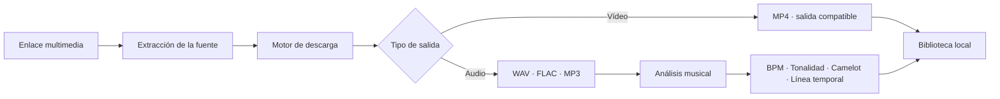
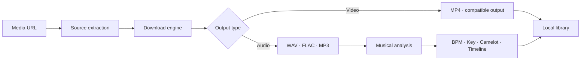

<!--
  DIAVLO WAV — README oficial bilingüe de publicaciones
  Coloca este archivo en: Nikolai-coder/diavlo-wav-releases/README.md
-->

<div align="center">


<a href="https://github.com/Nikolai-coder/diavlo-wav-releases/releases/latest">
  
</a>

<br />

[](https://github.com/Nikolai-coder/diavlo-wav-releases/releases/latest)
[](https://github.com/Nikolai-coder/diavlo-wav-releases/releases)
[](#requisitos-del-sistema--system-requirements)
[](#requisitos-del-sistema--system-requirements)
[](#identidad-canaria--canary-identity)

<br />

### Estación multimedia nativa para descargar, convertir y analizar contenido en Windows.
### Native Windows workstation for media extraction, conversion and musical analysis.

**Una aplicación. Un comando. Un flujo creativo.**  
**One application. One command. One focused workflow.**

[](https://github.com/Nikolai-coder/diavlo-wav-releases/releases/latest)
[](https://github.com/Nikolai-coder/diavlo-wav-releases/releases/latest/download/DiavloWAV-Setup-x64.exe)
[](https://github.com/Nikolai-coder/diavlo-wav-releases)

<br />

[🇪🇸 Español](#español)　•　[🇬🇧 English](#english)

`DESCARGA`　•　`CONVIERTE`　•　`ANALIZA`　•　`CREA`

</div>

---

# Español

## `01 // INSTALACIÓN`

Abre **PowerShell** y ejecuta:

```powershell
irm "https://github.com/Nikolai-coder/diavlo-wav-releases/releases/latest/download/install.ps1" | iex
```

El comando obtiene el instalador oficial desde la **última publicación de GitHub** e inicia el proceso de instalación compatible con Windows.

> [!IMPORTANT]
> Instala DIAVLO WAV únicamente desde este repositorio o desde los archivos oficiales de sus publicaciones en GitHub.

<details>
<summary><strong>Inspeccionar el instalador antes de ejecutarlo</strong></summary>

<br />

```powershell
$script = "$env:TEMP\diavlowav-install.ps1"

irm "https://github.com/Nikolai-coder/diavlo-wav-releases/releases/latest/download/install.ps1" `
  -OutFile $script

notepad $script
& $script
```

Esto guarda el script oficial en tu equipo, lo abre para revisarlo y solamente lo ejecuta cuando tú decides continuar.

</details>

<details>
<summary><strong>Instalación tradicional en Windows</strong></summary>

<br />

1. Abre la [última publicación](https://github.com/Nikolai-coder/diavlo-wav-releases/releases/latest).
2. Descarga `DiavloWAV-Setup-x64.exe`.
3. Ejecuta el instalador.
4. Abre DIAVLO WAV.

</details>

---

## `02 // EL PRODUCTO`

DIAVLO WAV es una **estación audiovisual nativa para Windows** creada para reducir la distancia entre encontrar contenido y tenerlo listo dentro de un flujo creativo.

Reúne extracción, manejo de listas, conversión de formatos, gestión local y análisis musical dentro de una sola interfaz de escritorio.

<table>
<tr>
<td width="33%" valign="top">

### ⬇️ Descargar

- Enlaces individuales
- Flujos con listas de reproducción
- Progreso en tiempo real
- Control de la carpeta de destino
- Fuentes compatibles con el motor de extracción
- Experiencia nativa de escritorio

</td>
<td width="33%" valign="top">

### ♻️ Convertir

- WAV
- FLAC
- MP3
- MP4
- Extracción de audio
- Procesamiento compatible con FFmpeg

</td>
<td width="33%" valign="top">

### 🎛️ Analizar

- Detección de BPM
- Tonalidad y modo musical
- Notación Camelot
- Indicadores de confianza
- Lectura half-time y double-time
- Cambios musicales en la línea temporal

</td>
</tr>
</table>

> [!NOTE]
> La compatibilidad con plataformas externas puede cambiar cuando estas modifican sus páginas o reglas de acceso. DIAVLO WAV no elimina DRM ni protecciones de servicios de pago.

---

## `03 // FLUJO DE SEÑAL`



```text
┌─ DIAVLO SIGNAL / NÚCLEO DE ANÁLISIS ─────────────────────────────┐
│                                                                  │
│  BPM             140                                             │
│  TONALIDAD       F# MENOR                                        │
│  CAMELOT         11A                                             │
│  CONFIANZA       ██████████████████░░  91%                       │
│                                                                  │
│  LÍNEA TEMPORAL                                                  │
│  00:00 ━━━━━━━━━━━ 01:12    140 BPM · F# Menor                   │
│  01:12 ━━━━━━━━━━━ 02:26    155 BPM · F# Menor                   │
│                                                                  │
│  DETECCIÓN       CAMBIO DE BPM                                   │
│  ESTADO          ANÁLISIS COMPLETADO                             │
│                                                                  │
└──────────────────────────────────────────────────────────────────┘
```

---

## `04 // POR QUÉ DIAVLO WAV`

| Capacidad | Enfoque DIAVLO |
|---|---|
| **Aplicación nativa para Windows** | Un flujo de escritorio dedicado en lugar de un laberinto de pestañas. |
| **Instalación con un comando** | La última versión compatible está siempre a una orden de distancia. |
| **Inteligencia para creadores** | BPM, tonalidad, Camelot y línea temporal permanecen junto al archivo. |
| **Procesamiento local** | Los archivos terminan en la ubicación que tú eliges para tu propio flujo. |
| **Publicaciones versionadas** | Cada versión pública se distribuye mediante publicaciones rastreables de GitHub. |
| **Verificación de integridad** | Los hashes publicados permiten comprobar los archivos descargados. |
| **Actualización obligatoria** | Las versiones compatibles pueden detectar e instalar actualizaciones necesarias. |

---

## `05 // NÚCLEO TECNOLÓGICO`

<div align="center">


</div>

```text
DIAVLO WAV
├── Aplicación de escritorio ... Tauri
├── Núcleo nativo .............. Rust
├── Interfaz ................... React + TypeScript
├── Flujo multimedia ........... FFmpeg + herramientas de extracción
├── Capa de análisis ........... BPM · tonalidad · detección estructural
├── Instalador ................. PowerShell + instalador de Windows
├── Actualizador ............... Flujo firmado de versiones
└── Distribución ............... GitHub Releases
```

> Este repositorio es el **canal público oficial de publicaciones**. El código de la aplicación puede mantenerse por separado.

---

## `06 // TELEMETRÍA EN VIVO`

<div align="center">

[](https://github.com/Nikolai-coder/diavlo-wav-releases/releases/latest)
[](https://github.com/Nikolai-coder/diavlo-wav-releases/releases/latest)
[](https://github.com/Nikolai-coder/diavlo-wav-releases/releases)
[](https://github.com/Nikolai-coder/diavlo-wav-releases/commits/main)
[](https://github.com/Nikolai-coder/diavlo-wav-releases)

</div>

---

## `07 // IDENTIDAD CANARIA` 🌋🌊

DIAVLO WAV nace en las **Islas Canarias**, entre paisaje volcánico, océano Atlántico y una cultura acostumbrada a mirar más allá del horizonte.

```text
NEGRO VOLCÁNICO   La base técnica: sólida, directa y resistente.
AZUL ATLÁNTICO    La conexión: abierta, rápida y preparada para viajar.
VIOLETA NOCTURNO  La identidad: oscura, creativa y reconocible.
ORIGEN            ISLAS CANARIAS · 28°N
DESTINO           CUALQUIER ESCRITORIO DEL MUNDO
```

> **Construido desde unas islas. Diseñado sin límites.**

---

## `08 // REQUISITOS DEL SISTEMA`

| Requisito | Configuración compatible |
|---|---|
| **Sistema operativo** | Windows 10 o Windows 11 |
| **Arquitectura** | x64 |
| **PowerShell** | Windows PowerShell 5.1+ o PowerShell 7+ |
| **Internet** | Necesario para instalar, actualizar y extraer contenido en línea |
| **Almacenamiento** | Depende de la duración, la lista y el formato de salida |
| **Permisos** | Permisos normales de instalación; puede solicitar elevación cuando sea necesario |

---

## `09 // VERIFICAR LA PUBLICACIÓN`

Los archivos publicados pueden incluir hashes SHA-256. Para calcular el hash del instalador:

```powershell
Get-FileHash ".\DiavloWAV-Setup-x64.exe" -Algorithm SHA256
```

Compara el resultado con el hash incluido en la publicación correspondiente.

<details>
<summary><strong>Comparación automática del hash</strong></summary>

<br />

```powershell
$installer = ".\DiavloWAV-Setup-x64.exe"
$checksumFile = ".\DiavloWAV-Setup-x64.exe.sha256"

$actual = (Get-FileHash $installer -Algorithm SHA256).Hash.ToLower()
$expected = ((Get-Content $checksumFile -Raw) -split '\s+')[0].Trim().ToLower()

if ($actual -eq $expected) {
    Write-Host "Integridad de DIAVLO WAV verificada." -ForegroundColor Green
} else {
    Write-Error "El hash no coincide. No ejecutes este instalador."
}
```

</details>

---

## `10 // SOLUCIÓN DE PROBLEMAS`

<details>
<summary><strong>PowerShell bloquea el comando</strong></summary>

<br />

Ejecuta el comando desde una ventana normal de PowerShell. Cuando una política de empresa o centro educativo bloquee scripts, utiliza el instalador `.exe` de la última publicación en lugar de reducir globalmente la seguridad del sistema.

</details>

<details>
<summary><strong>Una plataforma deja de funcionar</strong></summary>

<br />

Las páginas externas cambian con frecuencia. Instala primero la última versión de DIAVLO WAV. Algunas fuentes pueden requerir autenticación, cookies o no estar disponibles por restricciones regionales, de cuenta o DRM.

</details>

<details>
<summary><strong>Falla una descarga o conversión</strong></summary>

<br />

Comprueba que el enlace abre correctamente, existe espacio libre, la carpeta permite escritura, tienes la última versión y el formato elegido es compatible. Conserva el mensaje de error completo al informar del problema.

</details>

<details>
<summary><strong>La aplicación exige una actualización</strong></summary>

<br />

Completa la actualización desde el actualizador interno. Las versiones obligatorias pueden contener cambios de compatibilidad, seguridad o del motor multimedia necesarios para continuar funcionando correctamente.

</details>

---

## `11 // SEGURIDAD Y PRIVACIDAD`

- El procesamiento está diseñado alrededor de un **flujo local de escritorio**.
- Descarga únicamente desde este repositorio y sus archivos oficiales.
- Verifica los hashes cuando estén disponibles.
- No confíes en instaladores resubidos a páginas de terceros.
- No publiques contraseñas, tokens ni datos privados en los reportes.
- Revisa el script de instalación localmente cuando necesites máxima transparencia.

Para comunicar una posible vulnerabilidad, evita publicar detalles sensibles en una incidencia pública y contacta de forma privada con el mantenedor mediante su perfil de GitHub.

---

## `12 // HOJA DE RUTA`

```text
[✓] Instalador nativo para Windows
[✓] Instalación de arranque mediante PowerShell
[✓] Publicaciones versionadas en GitHub
[✓] Flujos de salida de audio y vídeo
[✓] Gestión de listas de reproducción
[✓] Análisis de BPM, tonalidad y Camelot
[✓] Detección de cambios en la línea temporal
[✓] Actualizador obligatorio dentro de la aplicación
[ ] Diagnósticos y herramientas de reparación ampliados
[ ] Controles más profundos de cola y biblioteca
[ ] Visualización de análisis más completa
[ ] Más mejoras de rendimiento y fiabilidad
```

La hoja de ruta indica dirección, no fechas garantizadas. Las versiones se publican cuando alcanzan el nivel de calidad necesario.

---

## `13 // USO RESPONSABLE`

DIAVLO WAV es una utilidad técnica para contenido multimedia. Úsala únicamente con archivos propios, contenido creado por ti, material de dominio público o contenido que tengas autorización legal para descargar y procesar.

El proyecto no está afiliado con YouTube, Spotify, SoundCloud, TikTok, X, Reddit, Apple, Tidal ni otras plataformas. Las marcas pertenecen a sus respectivos propietarios.

DIAVLO WAV no promete acceso a transmisiones protegidas por DRM ni está pensado para evitar controles de acceso, suscripciones o protecciones de derechos de autor.

---

# English

## `01 // INSTALLATION`

Open **PowerShell** and run:

```powershell
irm "https://github.com/Nikolai-coder/diavlo-wav-releases/releases/latest/download/install.ps1" | iex
```

The command retrieves the official installer from the **latest GitHub release** and starts the supported Windows installation flow.

> [!IMPORTANT]
> Install DIAVLO WAV only from this repository or its official GitHub release assets.

<details>
<summary><strong>Inspect the installer before running it</strong></summary>

<br />

```powershell
$script = "$env:TEMP\diavlowav-install.ps1"

irm "https://github.com/Nikolai-coder/diavlo-wav-releases/releases/latest/download/install.ps1" `
  -OutFile $script

notepad $script
& $script
```

This saves the official script locally, opens it for inspection and executes it only when you choose to continue.

</details>

<details>
<summary><strong>Traditional Windows installation</strong></summary>

<br />

1. Open the [latest release](https://github.com/Nikolai-coder/diavlo-wav-releases/releases/latest).
2. Download `DiavloWAV-Setup-x64.exe`.
3. Run the installer.
4. Launch DIAVLO WAV.

</details>

---

## `02 // THE PRODUCT`

DIAVLO WAV is a **native Windows audiovisual workstation** built to reduce the distance between discovering media and having it ready for a creative workflow.

It brings extraction, playlist handling, format conversion, local file management and musical analysis into one focused desktop interface.

<table>
<tr>
<td width="33%" valign="top">

### ⬇️ Download

- Individual URLs
- Playlist workflows
- Live progress states
- Local destination control
- Extractor-compatible sources
- Native desktop experience

</td>
<td width="33%" valign="top">

### ♻️ Convert

- WAV
- FLAC
- MP3
- MP4
- Audio extraction
- FFmpeg-compatible processing

</td>
<td width="33%" valign="top">

### 🎛️ Analyse

- BPM detection
- Musical key and mode
- Camelot notation
- Confidence indicators
- Half-time and double-time reading
- Timeline change detection

</td>
</tr>
</table>

> [!NOTE]
> Third-party compatibility can change whenever external platforms modify their websites or access rules. DIAVLO WAV does not bypass DRM or paid-service protections.

---

## `03 // SIGNAL PIPELINE`



---

## `04 // WHY DIAVLO WAV`

| Capability | DIAVLO approach |
|---|---|
| **Native Windows application** | A dedicated desktop workflow instead of a maze of browser tabs. |
| **One-command installation** | The latest supported release is always one command away. |
| **Creator-focused intelligence** | BPM, key, Camelot and timeline information remain beside the media. |
| **Local-first output** | Files are processed for your own local workflow and selected destination. |
| **Versioned releases** | Every public build is distributed through traceable GitHub releases. |
| **Integrity verification** | Published checksums can validate downloaded assets. |
| **Mandatory update flow** | Supported builds can detect and install required updates. |

---

## `05 // TECHNOLOGY CORE`

```text
DIAVLO WAV
├── Desktop shell ........ Tauri
├── Native core .......... Rust
├── Interface ............ React + TypeScript
├── Media pipeline ....... FFmpeg + extraction tooling
├── Analysis layer ....... BPM · key · structural detection
├── Installer ............ PowerShell + Windows setup
├── Updater .............. Signed release workflow
└── Distribution ......... GitHub Releases
```

This repository is the **official public release channel**. The application source may be maintained separately.

---

## `06 // CANARY IDENTITY` 🌋🌊

DIAVLO WAV was born in the **Canary Islands**, surrounded by volcanic landscapes, the Atlantic Ocean and a culture used to looking beyond the horizon.

```text
VOLCANIC BLACK    The technical foundation: solid and resilient.
ATLANTIC BLUE     The connection: open, fast and ready to travel.
MIDNIGHT VIOLET   The identity: dark, creative and recognisable.
ORIGIN            CANARY ISLANDS · 28°N
DESTINATION       DESKTOPS AROUND THE WORLD
```

> **Built on islands. Designed without limits.**

---

## `07 // SYSTEM REQUIREMENTS`

| Requirement | Supported configuration |
|---|---|
| **Operating system** | Windows 10 or Windows 11 |
| **Architecture** | x64 |
| **PowerShell** | Windows PowerShell 5.1+ or PowerShell 7+ |
| **Internet** | Required for installation, updates and online extraction |
| **Storage** | Depends on media length, playlist size and output format |
| **Permissions** | Standard installer permissions; elevation may be requested when required |

---

## `08 // VERIFY THE RELEASE`

Release assets may include SHA-256 checksum files. Calculate the installer hash with:

```powershell
Get-FileHash ".\DiavloWAV-Setup-x64.exe" -Algorithm SHA256
```

Compare the returned value with the checksum published in the matching GitHub release.

---

## `09 // TROUBLESHOOTING`

<details>
<summary><strong>PowerShell blocks the command</strong></summary>

<br />

Run it from a normal PowerShell window. If a company or school policy blocks scripts, use the traditional `.exe` installer instead of reducing the system security policy globally.

</details>

<details>
<summary><strong>A source stops working</strong></summary>

<br />

External websites change regularly. Install the latest DIAVLO WAV release first. Some sources may require authentication or cookies, or may be unavailable because of regional, account or DRM restrictions.

</details>

<details>
<summary><strong>A download or conversion fails</strong></summary>

<br />

Confirm the URL opens normally, enough disk space is available, the destination is writable, the latest version is installed and the selected format is compatible. Preserve the complete error message when reporting the problem.

</details>

---

## `10 // SECURITY & PRIVACY`

- Processing is designed around a **local desktop workflow**.
- Download only from this repository and its official release assets.
- Verify checksums whenever available.
- Never trust installers reuploaded to third-party websites.
- Do not publish passwords, private tokens or sensitive data in reports.
- Review the installer script locally whenever maximum transparency is needed.

For a potential vulnerability, avoid publishing sensitive details in a public issue and contact the maintainer privately through the GitHub profile.

---

## `11 // RELEASE ROADMAP`

```text
[✓] Native Windows installer
[✓] PowerShell bootstrap installation
[✓] Versioned GitHub release pipeline
[✓] Audio and video output workflows
[✓] Playlist handling
[✓] BPM, key and Camelot analysis
[✓] Timeline and musical change detection
[✓] Mandatory in-app update flow
[ ] Expanded diagnostics and repair tooling
[ ] Deeper queue and library controls
[ ] Broader analysis visualisation
[ ] More performance and reliability passes
```

Roadmap items describe direction, not guaranteed dates. Releases ship when they meet the required quality bar.

---

## `12 // RESPONSIBLE USE`

DIAVLO WAV is a technical media utility. Use it only for content you own, created, have permission to process or that belongs to the public domain.

The project is not affiliated with YouTube, Spotify, SoundCloud, TikTok, X, Reddit, Apple, Tidal or other platforms. Product names and trademarks belong to their respective owners.

DIAVLO WAV does not promise access to DRM-protected streams and is not intended to circumvent access controls, subscriptions or copyright protections.

---

<div align="center">

## `LA PRÓXIMA SEÑAL ES TUYA // THE NEXT SIGNAL IS YOURS`

[](https://github.com/Nikolai-coder/diavlo-wav-releases/releases/latest)
[](https://github.com/Nikolai-coder/diavlo-wav-releases/issues)
[](https://github.com/Nikolai-coder/diavlo-wav-releases)

<br />

**Creado por / Built by [Nikolai-coder](https://github.com/Nikolai-coder).**  
**Desarrollado desde las Islas Canarias · Built in the Canary Islands.**

`DIAVLO WAV // DOWNLOAD · CONVERT · ANALYSE · CREATE`


</div>
