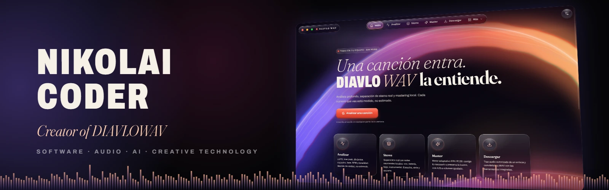
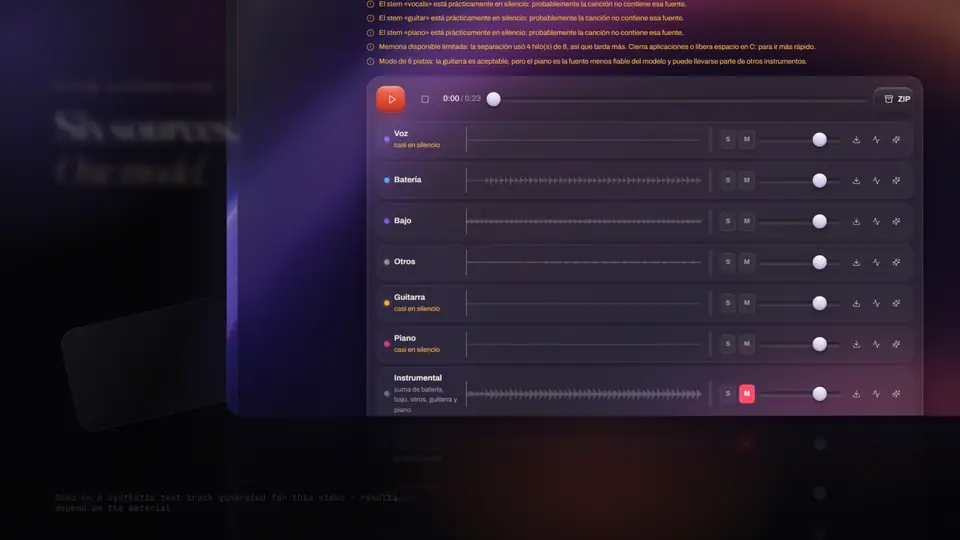
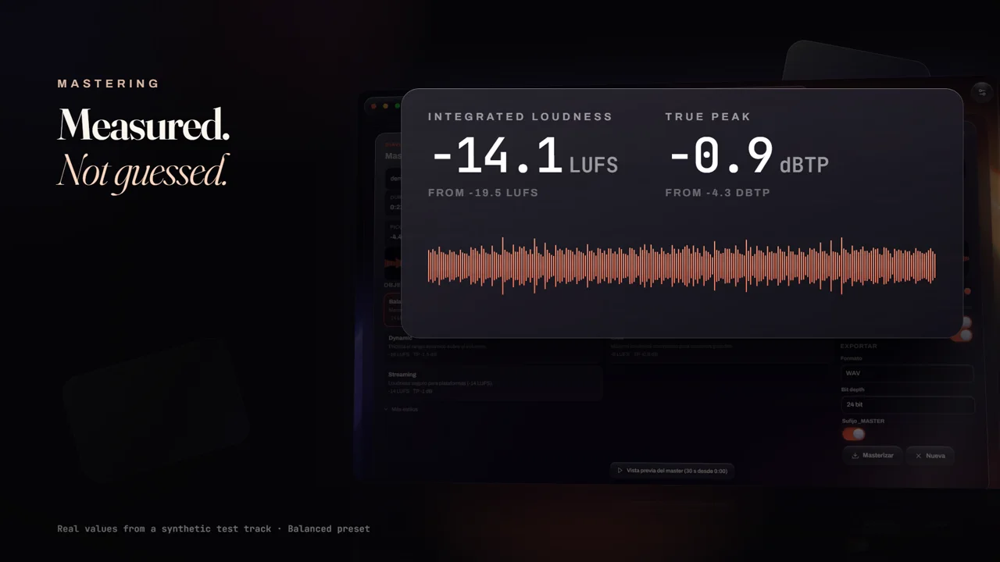
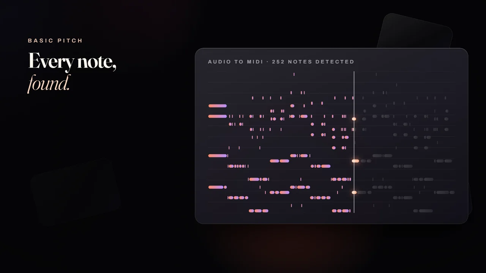

<div align="center">



<br />

# DIAVLOWAV

### Audio. Measured.

A local audio workstation for Windows.<br />
Analyse it, separate it, master it, turn it into MIDI. On your machine, with numbers you can trust.

<br />

[**Download for Windows**](https://github.com/Nikolai-coder/diavlo-wav-releases/releases/latest)　·　[Watch the film](media/diavlowav-hero.mp4)　·　[Install](#install)　·　[What it does](#what-it-does)　·　[Roadmap](#roadmap)

<br />

<a href="media/diavlowav-hero.mp4">
  
</a>

<sub>Recorded from the real application on a synthetic test track. Click to play the 26-second film.</sub>

</div>

<br />

## What it is

DIAVLOWAV is a desktop application for producers and creators who want to understand a piece of audio, split it apart and finish it without sending it to a remote service.

Every figure the interface shows is **measured on your machine**. When a value does not exist, the interface shows a dash, not an invented number. Processing is local by default; the network is used for update checks, model downloads, URL downloads you ask for, and optional providers you switch on yourself.

It is built as a product, with its own interface, its own type and its own motion, and it is released through signed, versioned GitHub Releases.

<br />

## What it does

<div align="center">


<h3>Stems</h3>

Local separation with <b>Hybrid Transformer Demucs v4</b>. Vocals, drums, bass and other, plus an instrumental derived by exact sample-wise sum. A synchronised multitrack player with mute, solo and volume, individual export and ZIP. Model weights are verified by SHA-256, progress is real, and a reconstruction check tells you how faithful the result is.<br /><br /><b>Six sources</b> (adding guitar and piano) arrived with v1.3.1; the piano is the least reliable source and the app says so.

</div>

<div align="center">



<h3>Mastering</h3>

Measurement first, then an adaptive plan: material that is already in good shape receives less processing, and every decision is written to a log. EBU R128 integrated, short-term, momentary and LRA, true peak verified on the exported file, presets (Balanced, Loud, Dynamic, Club, Streaming), WAV, FLAC, MP3, AAC, Opus and AIFF export, and A/B comparison at matched loudness. The original is never modified.

</div>

<div align="center">


<h3>Model browser</h3>

A searchable catalogue that rates every model against your processor, memory and disk with a crystal traffic light: green recommended, amber possible but slow, red not recommended. Only models the bundled engines can actually run are offered for download. All current engines run on the CPU, and the interface says so.

</div>

<div align="center">



<h3>Audio to MIDI</h3>

Melody, bass, drums and optional polyphonic transcription with Basic Pitch, previewed as a note roll before export.


</div>

**Also inside:** BPM and key analysis, spectrum, phase and stereo width, a sound fingerprint across several files, beat analysis, vocal preparation, loops, a sample finder, an export centre, a URL downloader built on `yt-dlp` and FFmpeg (WAV, FLAC and ALAC at up to 24 bits), model downloads that resume where they stopped, and a voice and text assistant with on-demand local AI. Spotify is used for metadata only and never for audio.

> [!NOTE]
> The interface is currently in Spanish.

<br />

## See it move

| | |
| :-- | :-- |
| [**The film**](media/diavlowav-hero.mp4) · 26 s | The whole product in one pass. |
| [**Stems**](media/diavlowav-stems.mp4) · 15 s | Model choice, the real engine running, the separated tracks. |
| [**Mastering**](media/diavlowav-mastering.mp4) · 15 s | Analysis, then loudness from −19.5 to −14.1 LUFS. |
| [**Model browser**](media/diavlowav-models.mp4) · 13 s | The hardware card and the crystal traffic light. |

All footage is recorded from the real application. The audio is a synthetic test track generated for these clips, so some separated stems are nearly silent in the demo; that is the track, not a cut.

<br />

## Install

<a id="install"></a>

**Windows 10 or 11, x64.**

1. Open the [latest release](https://github.com/Nikolai-coder/diavlo-wav-releases/releases/latest).
2. Download `DiavloWAV-Setup-x64.exe` and run it.
3. Launch DIAVLOWAV.

Or from PowerShell:

```powershell
irm "https://github.com/Nikolai-coder/diavlo-wav-releases/releases/latest/download/install.ps1" | iex
```

<details>
<summary><b>Inspect the script before running it</b></summary>

<br />

```powershell
$script = "$env:TEMP\diavlowav-install.ps1"
irm "https://github.com/Nikolai-coder/diavlo-wav-releases/releases/latest/download/install.ps1" -OutFile $script
notepad $script
& $script
```

</details>

<details>
<summary><b>Verify the download</b></summary>

<br />

Each release publishes a SHA-256 file next to the installer.

```powershell
$installer = ".\DiavloWAV-Setup-x64.exe"
$expected  = ((Get-Content "$installer.sha256" -Raw) -split '\s+')[0].Trim().ToLower()
$actual    = (Get-FileHash $installer -Algorithm SHA256).Hash.ToLower()
if ($actual -eq $expected) { "Integrity verified." } else { Write-Error "Checksum mismatch. Do not run this installer." }
```

The updater payload is additionally signed with a minisign-compatible key, and the application refuses an update whose signature does not match.

</details>

<br />

## Updating

DIAVLOWAV checks for updates when it starts. Updates are downloaded with real progress, verified against the signature, and installed in place. Your settings, projects, history and downloaded models are kept. You can also check by hand under Settings → Updates.

<br />

## Requirements

| | |
| :-- | :-- |
| **System** | Windows 10 or 11, x64 |
| **Memory** | Audio to MIDI and analysis are comfortable on 4 GB. Stem separation needs 8 GB at minimum and is happier with 12 to 16 GB depending on the model; it checks available memory before it starts and lowers its own thread count instead of crashing. The model browser rates your exact machine. |
| **Disk** | Stem models are downloaded on demand: about 80 MB for Fast and about 336 MB for High quality. |
| **Graphics** | Not required. All current engines run on the CPU. |

<br />

## Roadmap

<a id="roadmap"></a>

| | |
| :-- | :-- |
| **Shipping** | Analysis with tempo and key detection that rates its own confidence, four- and six-source stem separation, mastering, audio to MIDI, a voice and text assistant with on-demand local AI, a model browser with resumable downloads, lossless music downloads at up to 24 bits, signed updater. |
| **Next** | A redesigned download experience. |
| **Mobile** | Android is in development; a debug build exists and is not released. iOS is planned. |

Roadmap items describe direction, not dates.

<br />

## Releases and source

<a id="releases"></a>

This repository is the official public distribution channel. Every release is built by GitHub Actions and published with its checksum and signature. The application source is maintained privately.

All [releases](https://github.com/Nikolai-coder/diavlo-wav-releases/releases) stay available, and the [changelog](https://github.com/Nikolai-coder/diavlo-wav-releases/releases) lives in each release's notes.

<br />

## Credits

DIAVLOWAV stands on open work: [Demucs](https://github.com/facebookresearch/demucs) (Hybrid Transformer Demucs) through [demucs.cpp](https://github.com/sevagh/demucs.cpp), Spotify's [Basic Pitch](https://github.com/spotify/basic-pitch), [FFmpeg](https://ffmpeg.org), [yt-dlp](https://github.com/yt-dlp/yt-dlp), [Tauri](https://tauri.app), [React](https://react.dev) and [Symphonia](https://github.com/pdeljanov/Symphonia). Model licences are listed inside the application.

<br />

## Responsible use

DIAVLOWAV is a technical audio utility. Use it on material you own, made yourself, that is in the public domain, or that you are authorised to process. It does not bypass DRM, subscriptions or access controls, and it is not affiliated with YouTube, Spotify, SoundCloud, TikTok, Apple, Tidal or any other platform; their names belong to their owners.

Found a problem? [Open an issue](https://github.com/Nikolai-coder/diavlo-wav-releases/issues) and include the exact error text, never passwords, cookies or tokens. For a security concern, avoid posting exploit details publicly and reach out through the [profile](https://github.com/Nikolai-coder).

<br />

<div align="center">

**Built by [Nikolai Coder](https://github.com/Nikolai-coder).**

<sub>Binary distribution. All rights reserved. See <a href="LICENSE">LICENSE</a>.</sub>

</div>
