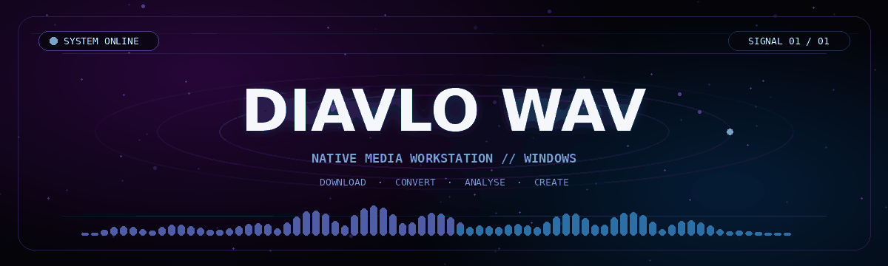
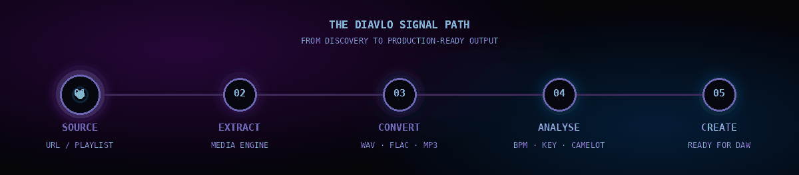
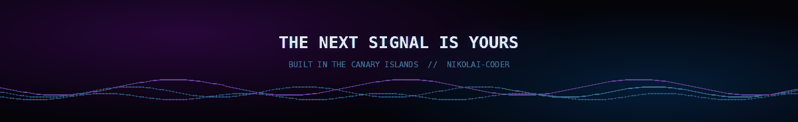

<!--
  DIAVLO WAV — Official Releases README
  Repository: https://github.com/Nikolai-coder/diavlo-wav-releases
  Rename this file to README.md when copying it into the repository root.
-->

<div align="center">



<br />

<a href="https://github.com/Nikolai-coder/diavlo-wav-releases/releases/latest">
  
</a>

<br />

[](https://github.com/Nikolai-coder/diavlo-wav-releases/releases/latest)
[](https://github.com/Nikolai-coder/diavlo-wav-releases/releases)
[](#system-requirements)
[](#system-requirements)
[](https://github.com/Nikolai-coder/diavlo-wav-releases/releases/latest)

<br />

### Native media extraction, conversion and musical intelligence for Windows.

**One application. One command. One focused creative workflow.**

<br />

[](https://github.com/Nikolai-coder/diavlo-wav-releases/releases/latest)
[](https://github.com/Nikolai-coder/diavlo-wav-releases/releases/latest/download/DiavloWAV-Setup-x64.exe)
[](https://github.com/Nikolai-coder/diavlo-wav-releases/issues)
[](https://github.com/Nikolai-coder/diavlo-wav-releases)

<br />

[`INSTALL`](#installation)　•　[`CAPABILITIES`](#capabilities)　•　[`PIPELINE`](#signal-pipeline)　•　[`SECURITY`](#security--privacy)　•　[`SUPPORT`](#troubleshooting)

</div>


<a id="installation"></a>

## `01 // INSTALLATION`

### One command. Latest supported build.

Open **PowerShell** and run:

```powershell
irm "https://github.com/Nikolai-coder/diavlo-wav-releases/releases/latest/download/install.ps1" | iex
```

The bootstrap retrieves the official installer script from the **latest GitHub release** and starts the supported Windows installation flow.

> [!IMPORTANT]
> Install DIAVLO WAV only from this repository or its official GitHub release assets.

<details>
<summary><strong>Inspect the installer before running it</strong></summary>

<br />

```powershell
$script = "$env:TEMP\diavlowav-install.ps1"

irm "https://github.com/Nikolai-coder/diavlo-wav-releases/releases/latest/download/install.ps1" `
  -OutFile $script

notepad $script
& $script
```

This stores the official script locally, opens it for inspection and executes it only when you choose to continue.

</details>

<details>
<summary><strong>Use the traditional Windows installer</strong></summary>

<br />

1. Open the [latest release](https://github.com/Nikolai-coder/diavlo-wav-releases/releases/latest).
2. Download `DiavloWAV-Setup-x64.exe`.
3. Run the installer.
4. Launch DIAVLO WAV.

</details>

<a id="capabilities"></a>

## `02 // CAPABILITIES`

DIAVLO WAV compresses the distance between **finding media** and **using it inside a creative session**. Extraction, conversion, local file control and musical analysis live inside one native Windows workspace.

<table>
<tr>
<td width="33%" valign="top">

### `↓` EXTRACT

- Individual media URLs
- Playlist workflows
- Live progress states
- Local destination control
- Extractor-compatible sources
- Native desktop experience

</td>
<td width="33%" valign="top">

### `↻` CONVERT

- WAV
- FLAC
- MP3
- MP4
- Audio extraction
- FFmpeg media processing

</td>
<td width="33%" valign="top">

### `◈` ANALYSE

- BPM detection
- Musical key and mode
- Camelot notation
- Confidence indicators
- Half-time / double-time reading
- Timeline change detection

</td>
</tr>
</table>

> [!NOTE]
> Source compatibility can change when third-party platforms update their websites or access rules. DIAVLO WAV does not bypass DRM or paid-service protections.


<a id="signal-pipeline"></a>

## `03 // SIGNAL PIPELINE`

<div align="center">



</div>

```text
┌─ DIAVLO SIGNAL / ANALYSIS CORE ──────────────────────────────────┐
│                                                                  │
│  BPM             140                                             │
│  KEY             F# MINOR                                        │
│  CAMELOT         11A                                             │
│  CONFIDENCE      ██████████████████░░  91%                       │
│                                                                  │
│  TIMELINE                                                        │
│  00:00 ━━━━━━━━━━━ 01:12    140 BPM · F# Minor                   │
│  01:12 ━━━━━━━━━━━ 02:26    155 BPM · F# Minor                   │
│                                                                  │
│  DETECTION       BPM SWITCH                                      │
│  STATUS          ANALYSIS COMPLETE                               │
│                                                                  │
└──────────────────────────────────────────────────────────────────┘
```

## `04 // WHY DIAVLO WAV`

| Signal | DIAVLO approach |
|:---|:---|
| **Native desktop** | A dedicated Windows workflow instead of a maze of browser tabs. |
| **One-command install** | The latest supported release is always one command away. |
| **Creator intelligence** | BPM, key, Camelot and timeline data stay beside the media. |
| **Local-first output** | Your files land in the local destination you choose. |
| **Traceable releases** | Public builds ship through versioned GitHub Releases. |
| **Integrity checks** | Published SHA-256 checksums can validate release assets. |
| **Mandatory updater** | Supported builds can detect and install required updates. |

<div align="center">

> **LESS FRICTION // MORE SIGNAL // FASTER CREATION**

</div>

## `05 // TECHNOLOGY CORE`

<div align="center">


</div>

```text
DIAVLO WAV
├── Desktop shell ........ Tauri
├── Native core .......... Rust
├── Interface ............ React + TypeScript
├── Media pipeline ....... FFmpeg + extraction tooling
├── Analysis layer ....... BPM · key · structural detection
├── Installer ............ PowerShell + Windows setup
├── Updater .............. Signed release/update workflow
└── Distribution ......... GitHub Releases
```

> [!TIP]
> This repository is the **official public release channel**. The application source can be maintained separately.

## `06 // LIVE RELEASE TELEMETRY`

<div align="center">

[](https://github.com/Nikolai-coder/diavlo-wav-releases/releases/latest)
[](https://github.com/Nikolai-coder/diavlo-wav-releases/releases/latest)
[](https://github.com/Nikolai-coder/diavlo-wav-releases/releases)
[](https://github.com/Nikolai-coder/diavlo-wav-releases/commits/main)
[](https://github.com/Nikolai-coder/diavlo-wav-releases)
[](https://github.com/Nikolai-coder/diavlo-wav-releases/issues)

</div>

<a id="system-requirements"></a>

## `07 // SYSTEM REQUIREMENTS`

| Requirement | Supported configuration |
|:---|:---|
| **Operating system** | Windows 10 or Windows 11 |
| **Architecture** | x64 |
| **PowerShell** | Windows PowerShell 5.1+ or PowerShell 7+ |
| **Internet** | Required for installation, updates and online extraction |
| **Storage** | Depends on media length, playlist size and output format |
| **Permissions** | Standard installer permissions; elevation may be requested when required |

## `08 // VERIFY THE RELEASE`

Release assets can include SHA-256 checksum files. Calculate the Windows installer hash with:

```powershell
Get-FileHash ".\DiavloWAV-Setup-x64.exe" -Algorithm SHA256
```

Compare the returned value with the checksum published in the matching GitHub release.

<details>
<summary><strong>Automate the checksum comparison</strong></summary>

<br />

```powershell
$installer = ".\DiavloWAV-Setup-x64.exe"
$checksumFile = ".\DiavloWAV-Setup-x64.exe.sha256"

$actual = (Get-FileHash $installer -Algorithm SHA256).Hash.ToLower()
$expected = ((Get-Content $checksumFile -Raw) -split '\s+')[0].Trim().ToLower()

if ($actual -eq $expected) {
    Write-Host "DIAVLO WAV integrity verified." -ForegroundColor Green
} else {
    Write-Error "Checksum mismatch. Do not execute this installer."
}
```

</details>

<a id="troubleshooting"></a>

## `09 // TROUBLESHOOTING`

<details>
<summary><strong>PowerShell blocks the command</strong></summary>

<br />

Run it in a normal PowerShell window. If a company or school policy blocks scripts, use the traditional `.exe` installer from the latest release instead of weakening the machine's global security policy.

</details>

<details>
<summary><strong>A source stops working</strong></summary>

<br />

Third-party websites change regularly. Install the latest DIAVLO WAV release first. Some sources can require authentication or cookies, and others may be unavailable because of regional, account or DRM restrictions.

</details>

<details>
<summary><strong>A download or conversion fails</strong></summary>

<br />

Confirm that:

- the URL opens normally in your browser;
- you have enough free disk space;
- the destination folder is writable;
- the latest application version is installed;
- the selected output is compatible with the source.

Retry once and preserve the complete error message when [reporting the issue](https://github.com/Nikolai-coder/diavlo-wav-releases/issues).

</details>

<details>
<summary><strong>The application requests a mandatory update</strong></summary>

<br />

Complete the update from the in-app updater. Mandatory releases can contain compatibility, security or media-engine changes required for the application to continue operating correctly.

</details>


<a id="security--privacy"></a>

## `10 // SECURITY & PRIVACY`

- Processing is designed around a **local desktop workflow**.
- Download only from this repository and its official release assets.
- Verify checksums when available.
- Never trust installers reuploaded to third-party websites.
- Never paste passwords, cookies, private tokens or secrets into issue reports.
- Inspect the installer script locally whenever you need maximum transparency.

For a potential security vulnerability, avoid publishing sensitive exploit details in a public issue. Contact the maintainer privately through the available [GitHub profile channels](https://github.com/Nikolai-coder).

## `11 // RELEASE ROADMAP`

```text
[✓] Native Windows installer
[✓] PowerShell bootstrap installation
[✓] Versioned GitHub release pipeline
[✓] Audio and video output workflows
[✓] Playlist handling
[✓] BPM, key and Camelot analysis
[✓] Timeline and musical change detection
[✓] Mandatory in-app update flow
[ ] Expanded diagnostics and repair tooling
[ ] Deeper queue and library controls
[ ] Broader analysis visualisation
[ ] More performance and reliability passes
```

Roadmap items describe direction, not guaranteed dates. Releases ship when they meet the required quality bar.

## `12 // RESPONSIBLE USE`

DIAVLO WAV is a technical media utility. Use it only for content you own, created yourself, that is in the public domain or that you are legally authorised to download and process.

The project is not affiliated with YouTube, Spotify, SoundCloud, TikTok, X, Reddit, Apple, Tidal or other third-party platforms. Product names and trademarks belong to their respective owners.

DIAVLO WAV does not promise access to DRM-protected streams and is not intended to circumvent access controls, subscriptions or copyright protections.

<div align="center">

<br />

[](https://github.com/Nikolai-coder/diavlo-wav-releases/releases/latest)
[](https://github.com/Nikolai-coder/diavlo-wav-releases/issues)
[](https://github.com/Nikolai-coder/diavlo-wav-releases)

<br />

**Built by [Nikolai-coder](https://github.com/Nikolai-coder).**

`DIAVLO WAV // DOWNLOAD · CONVERT · ANALYSE · CREATE`

<br />



</div>
